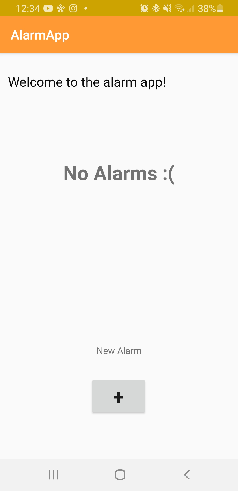
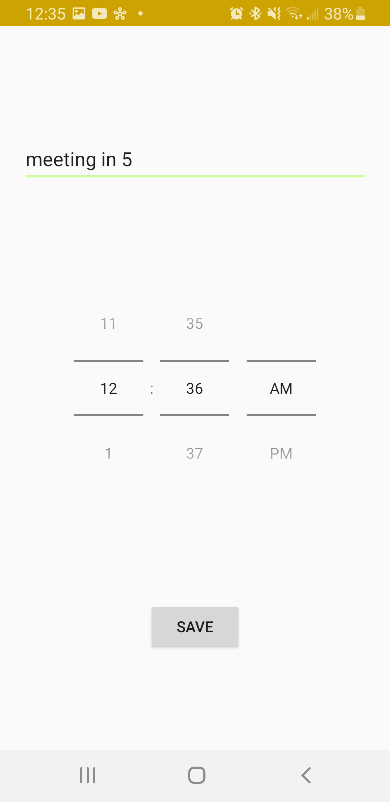
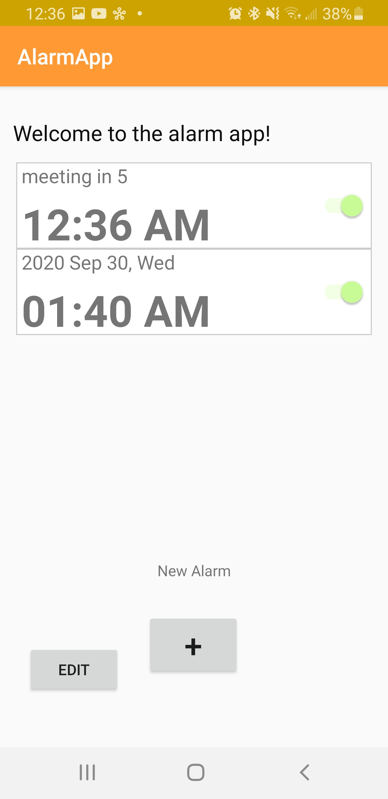
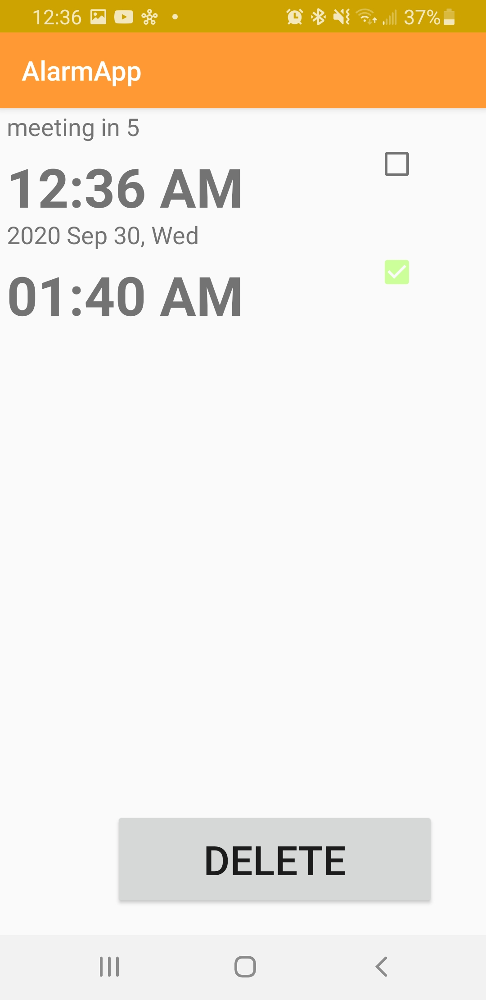
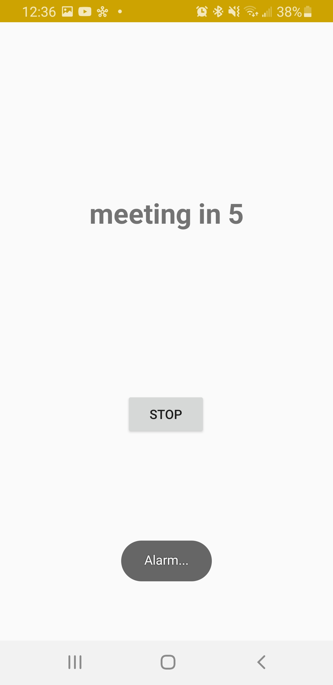

# AlarmAppProject

#### This is the very first Android app I made!

## Summary:
#### This is an app that is capable of setting alarms for you.   It lets you set up the time you want your alarm to sound as well as a message to display when it sounds.   This app was a good challenge because it forced me to learn different aspects of Android mobile development such as: permissions, services, and broadcasts and receivers.

## First Event:
<h2 align="center">This is the welcome page, click the + button to create your first alarm.</h2>

  

## Creating an Alarm Event:
<h2 align="center">This is the UI for creating an alarm, this app supports setting an alarm off at any time along with a message.</h2>

  

## Alarms Displayed on Main Dashboard:
<h2 align="center">Once you have alarms created, they will show up on the main dashboard.   If you look closely you will see that an "edit" button shows now as well.</h2>

  

## Edit Alarms Event:
<h2 align="center">If you click on the edit button, this event will come up which allows you to delete any alarms you may not want.</h2>

  

## Alarm Event:
<h2 align="center">This is the alarm page that displays your message to you when your alarm sounds.</h2>

  

